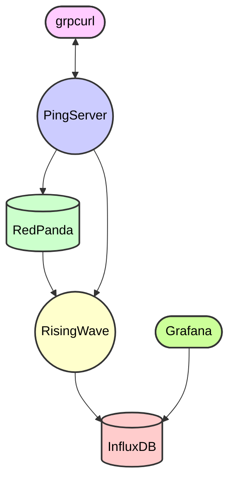

# Ping 2

This is a rebuild of the original [Ping](https://github.com/wcygan/ping) project.

The goal of this project is to use new technologies like RedPanda and RisingWave to understand how "cloud-native" they
are; basically, how easy they are to build with on Kubernetes when compared to their counterparts like Kafka and Flink.

## Quickstart

Terminal 1:

```bash
skaffold dev
```

Terminal 2:

```bash
grpcurl -plaintext localhost:8080 ping.v1.PingService/Ping
```

## Diagram



## Architecture

The architecture of this project involves several components interacting to process and visualize ping events. Here is a summary of the interactions:

1. **grcpurl <-> ping server**: The `grcpurl` tool is used to ping the server.
2. **ping-server -> redpanda**: The ping server streams ping events to RedPanda.
3. **redpanda -> risingwave**: RedPanda processes the event stream and sends it to RisingWave.
4. **risingwave -> influxdb**: RisingWave sinks the time series data into InfluxDB.
5. **grafana -> influxdb**: Grafana visualizes the time series data stored in InfluxDB.
6. **ping-server -> risingwave**: The ping server fetches materialized views from RisingWave.

This architecture ensures efficient processing and visualization of ping events through a series of well-defined interactions between the components.


## Tech Stack

| Technology                                                                                                                                                              | Purpose                  |
|-------------------------------------------------------------------------------------------------------------------------------------------------------------------------|--------------------------|
| [Java](https://dev.java/)                                                                                                                                               | Server Language          |
| [gRPC](https://grpc.io/docs/languages/java/quickstart/)                                                                                                                 | RPC Framework            |
| [Protocol Buffers](https://protobuf.dev/)                                                                                                                               | Schema Definition        |
| [RedPanda](https://www.redpanda.com/)                                                                                                                                   | Data Streaming           |
| [RisingWave](https://risingwave.com/)                                                                                                                                   | Stream Processor         |
| [InfluxDB](https://www.influxdata.com/)                                                                                                                                 | Time Series Data Storage |
| [Grafana](https://grafana.com/)                                                                                                                                         | Data Visualization       |
| [Buf Schema Registry](https://buf.build/product/bsr)                                                                                                                    | Schema Registry          |
| [Kubernetes](https://kubernetes.io/)                                                                                                                                    | Container Orchestration  |
| [Minikube](https://minikube.sigs.k8s.io/docs/start/?arch=%2Fmacos%2Farm64%2Fstable%2Fbinary+download) (or [Kind](https://kind.sigs.k8s.io/), or whatever else you have) | K8S Cluster              |
| [Skaffold](https://skaffold.dev/)                                                                                                                                       | K8S Deployment           |
| [Orbstack](https://orbstack.dev/) (or [Docker Desktop](https://www.docker.com/products/docker-desktop/))                                                                | Container Virtualization |

## Schema Definition

To save time we will rely on the *already-built* [Ping schema](https://buf.build/wcygan/ping) ([source code](https://github.com/wcygan/ping/blob/main/proto/ping/v1/ping.proto)) instead of building to scaffolding
out for this project.

The [SDKs](https://buf.build/wcygan/ping/sdks) can be added like so:

```xml
<!-- pom.xml -->
<repositories>
  <repository>
    <name>Buf Maven Repository</name>
    <id>buf</id>
    <url>https://buf.build/gen/maven</url>
    <releases>
      <enabled>true</enabled>
    </releases>
    <snapshots>
      <enabled>false</enabled>
    </snapshots>
  </repository>
</repositories>

<dependencies>
  <dependency>
    <groupId>build.buf.gen</groupId>
    <artifactId>wcygan_ping_grpc_java</artifactId>
    <version>1.68.1.1.20241014170349.9ebcb8552d88</version>
  </dependency>
</dependencies>

<dependencies>
  <dependency>
    <groupId>build.buf.gen</groupId>
    <artifactId>wcygan_ping_protocolbuffers_java</artifactId>
    <version>28.3.0.2.20241014170349.9ebcb8552d88</version>
  </dependency>
</dependencies>
```